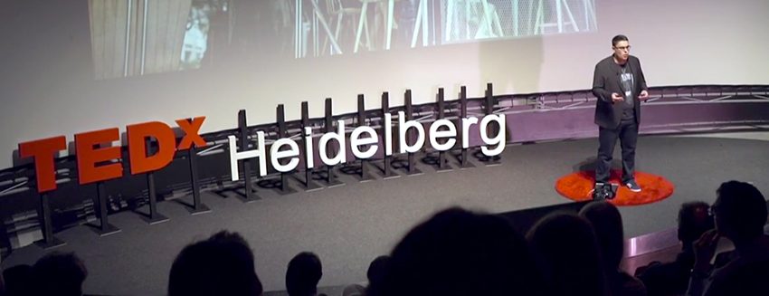

## Hi there 👋

I’m a Principal Software Engineer and Tech Lead with over 15 years of experience in the IT and software industry.

I’m passionate about fostering a culture of open communication, continuous learning, and shared growth. As a tech lead, I believe that when individuals, teams, and the company grow together, true and lasting success emerges.

During my time at Shopware, I’ve contributed to its remarkable growth — helping the company expand from around 40 to over 400 employees. I’ve played an active role in several organizational and operational transformations that have evolved Shopware into a mature, professional software company.

I believe in user-centric, autonomous teams that go beyond writing code — teams that embrace the complexity of the customer’s problem domain. I advocate for continuous delivery and code ownership, not as policy, but as part of a seamless continuum of care:  

“You build it, you run it.”

## 👤 **Professional Focus & Expertise**

- 💡 **Leadership & Mentoring** – Helping people grow and build strong, autonomous teams.
- 🧭 **Organizational Transformation** – Driving change towards modern engineering and product practices.
- 🚀 **Continuous Delivery & DevOps** – Advocating *“You build it, you run it”* and a seamless software delivery lifecycle.
- 🧩 **Framework Development** – Designing scalable, maintainable, and user-centric systems.
- 👥 **User-Centric Development** – Empowering teams to own and solve real customer problems  
- 🧠 **Continuous Learning** – Fostering a culture of curiosity, reflection, and shared knowledge.
- 🤝 **Collaboration & Communication** – Promoting openness, trust, and clear alignment across teams.
